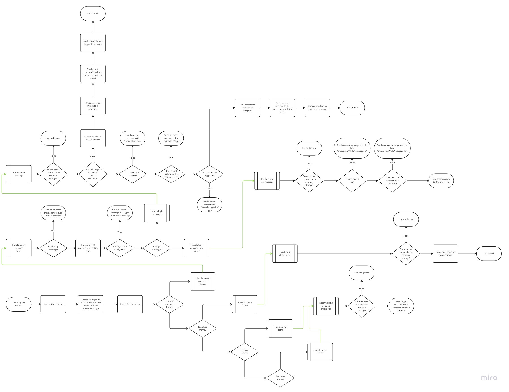

# Backend overview

This is an overview of how backend works, which patterns are used and some auxiliary information on the project.

I based the project on an [npm websocket library](https://www.npmjs.com/package/websocket). In the middle of
development,
I realized that the package is a bit outdated and there is a more popular one, but it was too late for me to switch.
However, the package seems to be working fine for my tasks and in the worst case it can be replaced to alternatives,
such as:

1. [ws](https://www.npmjs.com/package/ws) package.
2. [Native JS WebSocket](https://developer.mozilla.org/en-US/docs/Web/API/WebSocket).

The business logic layer is relatively thin and it shouldn't be a problem to refactor if necessary.

## The flow

Refer to the image below for the flow of backend.

The flow does not show automated ping requests and login cleanups.

## ESLint and Prettier

The app uses [ESLint](https://typescript-eslint.io/) and [Prettier](https://prettier.io/) to enforce consistent code
style and catch common programming errors.

## Runtime type checking with `io-ts`

All serializable communications are additionally verified in runtime using [io-ts](https://github.com/gcanti/io-ts).
Refer to the documentation of the library for more details.

## HTTPS (WSS) support

As of the time of writing this document, the application doesn't support secured connections and uses plain `ws`
protocol. This poses certain security risks, but since this is PoC, I didn't want to mess around with certificates and
secure handshakes. This should be a relatively simple change in the future.

## Data and connection persistence

Currently, both connections and data are not persisted. Login and connection information is stored in memory and is
lost during a server restart. Messages are not persisted at all. Since login handling is abstracted behind an interface,
it can be replaced with a proper Redis/DB storage.

I couldn't find a good reason for persisting connection info, since connections can be re-established at a relatively
low cost.

## Connection storage logic

Each connection is stored in memory until either:

- The client closes connection in a way that it is caught by `onclose` handler.
- Or the client does not respond to pings for 5 minutes.

The latter part may be improved by using [exponential backoff](https://en.wikipedia.org/wiki/Exponential_backoff)

## Login (storage) logic

When every connection interacts with the socket, it has to log in first. The login is just an arbitrary name a user
chooses to input in a form on the frontend. If user tries to send a message without logging in, they would receive an
error message specifying the reason.

When a user logs ins, they receive a secret. This secret may be used later to login under the same name again. If a user
does not provide a secret during the logging in process, the system considers such login "new" and if the username is
available -- it will be assigned to that user.

Evey ping and pong message from the client associated with the login counts as "activity". The secret is removed after
10 minutes of the login inactivity. After that time, a new user can log in under that login. If
the secret is lost by a client -- then there is nothing else they can do, but wait for the login to be released.

The logic is obviously not user-friendly and quite fragile. However, implementing a proper security layer would've
required a lot of efforts, which is out of the scope at the moment.

## Automatic pings

Every `HEARTBEAT_START_TIMEOUT_MS` the backend sends pings to all clients. After an additional 1 second, it checks if
there are any dangling connections left. Dangling connection is a connection that didn't respond for pings for more than
5 minutes in a row.
